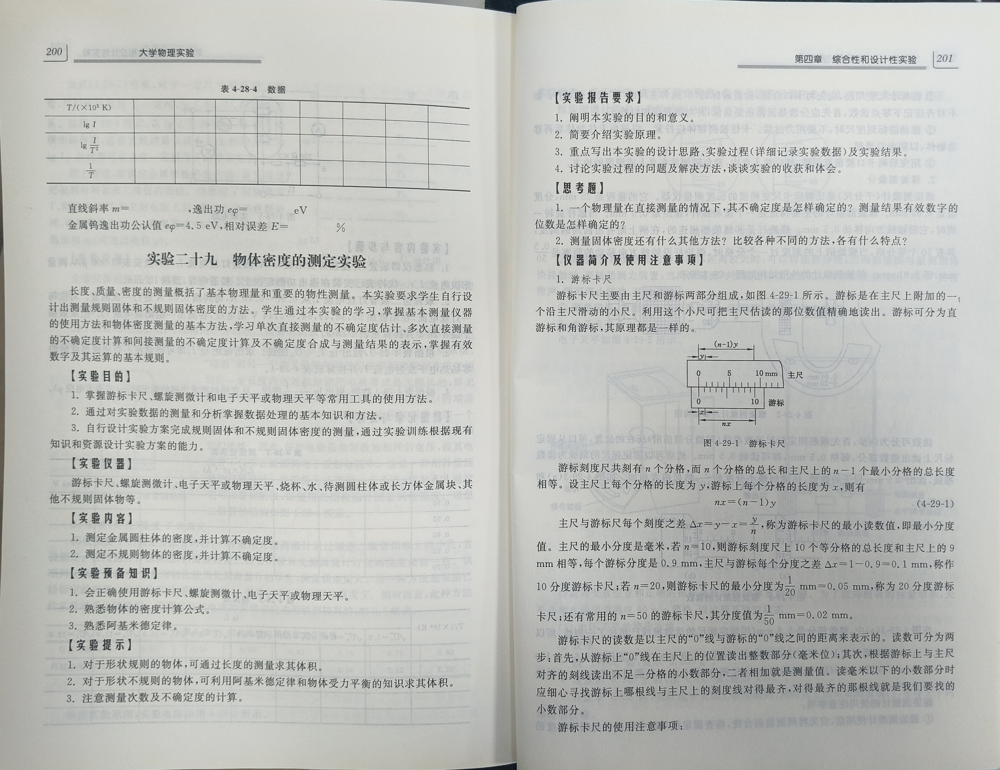
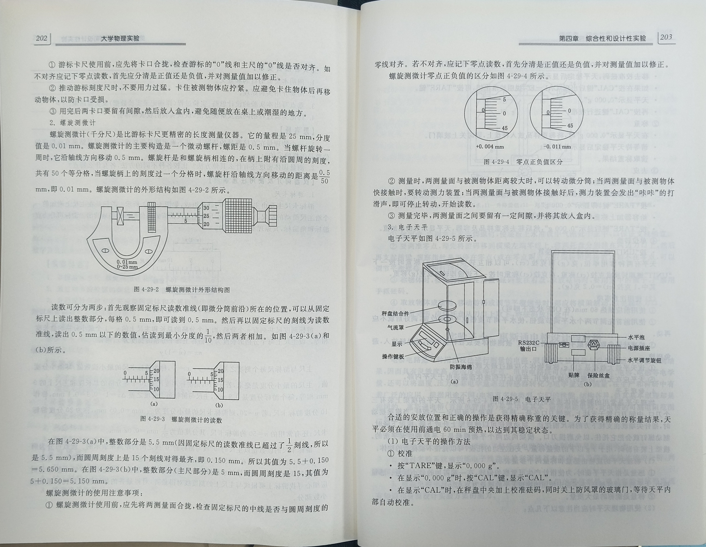
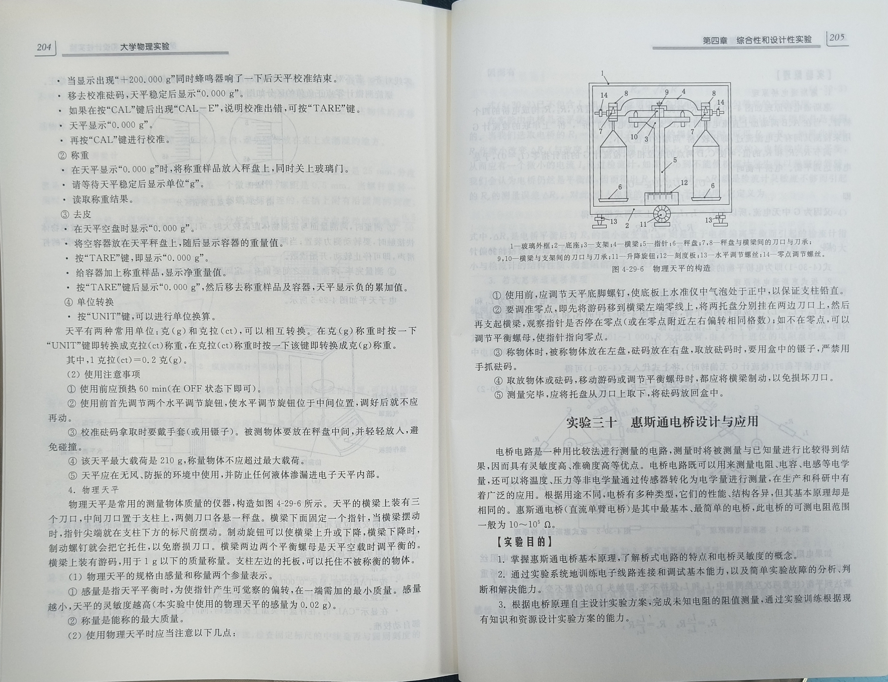

# PhysScene: A Scene Graph Dataset for Scientific Visual Reasoning in Physics Experiments

## 📥 Download

- **Images can be download at [Here](https://drive.google.com/file/d/1TFqrm0HJSXRIGNiXXGiQIR3Qp6FmW4M9/view?usp=sharing)!**
- **Annotations can be download at [Here](https://drive.google.com/file/d/1yhih6c3b5LQTz54PTSNnML-18Myx7Psu/view?usp=drive_link)!**

## 📘 Experimental Manual

**We adopt the textbook “University Physics Experiments” published by China University of Mining and Technology Press, a widely used “13th Five-Year Plan” higher-education textbook in China.**

**The manual includes comprehensive descriptions of physics experiments:**

- 🧰 **Experimental instrument**
- 🎯 **Experimental purpose**
- 🧪 **Experimental content**
- ▶️ **Operational procedures**
- ⚠️ **Precautions and notes**

**The following figure shows the cover of the *University Physics Experiments* manual and a summary page of one representative experiment. These pages illustrate the structured descriptions—purposes, instruments, procedures, and operation flows—that serve as the foundation for the PhysScene dataset design and annotation.**

  

## 🔍 Sample Manual for the Object Density Measurement Experiment

**To view the full instructions for all experiments, please refer to the complete manual.**

**Below is a sample set of pages from the manual.**

  

  

  

## :bar_chart: Fine-Grained experimental results

### (1) Performance across object types

  

### (2) Performance across relation types

**Detailed results are coming soon...**

  

## 🛡️ Ethics & Data Governance

**This dataset involves human participants in both data collection and recording processes. We take ethical considerations, privacy protection, and responsible data usage seriously.**

### License

**PhysScene is released under the CC BY-NC 4.0 License. The dataset may be used for non-commercial research and academic purposes with appropriate attribution. Commercial use is prohibited without prior permission. Users are expected to:**

* **Use the data responsibly and ethically**
* **Avoid attempts to identify or contact participants**
* **Comply with all applicable laws and institutional guidelines**

### Human Subjects

**Participants were informed about the purpose and procedure of the data collection in advance. Participation was voluntary, and individuals had the right to decline or withdraw at any time.**

### Privacy & Anonymization

**All data has been reviewed to minimize personally identifiable information.**

### Ethical Compliance

**The data collection process follows standard ethical guidelines for human-subject research.**

### Release Status

🚧 **The current version of the dataset has been fully released. Additional experimental types and more comprehensive annotations will be continuously updated and made available at this repository.**

### Contact

**If you have any concerns regarding ethics, privacy, or data usage, please contact us.**
